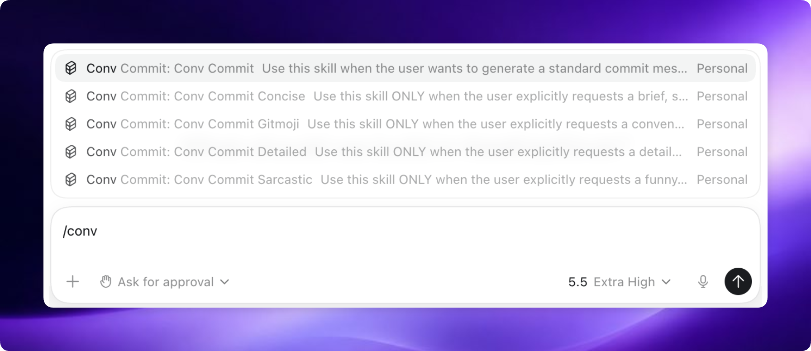

# conv-commit

`conv-commit` is a complete methodology for your coding agents, built on top of a set of composable skills that ensure your agent generates perfect Conventional Commits every single time.

## Quickstart

Give your agent the power to write perfect commits: [Claude Code](#claude-code), [Codex CLI](#codex-cli), [Codex App](#codex-app), [OpenCode](#opencode).

## Supported Tools

| Tool | Support | Install path | Skill invocation |
| --- | --- | --- | --- |
| Claude Code | Supported | `/plugin marketplace add https://github.com/dhanabhon/conv-commit` then `/plugin install conv-commit@conv-commit` | `/conv-commit:conv-commit` |
| Codex CLI | Supported | `/plugin install https://github.com/dhanabhon/conv-commit` | Automatic skill selection |
| Codex App | Supported | Install from custom plugin URL | Automatic skill selection |
| OpenCode | Supported | `opencode plugin "conv-commit@git+https://github.com/dhanabhon/conv-commit.git" --global` | Native `skill` tool |

## Preview



## How it works

It starts from the moment you stage your changes. Instead of writing paragraphs of text or messy, inconsistent commit logs, your agent evaluates the diff and automatically invokes the appropriate `conv-commit` skill.

It enforces the strict rules of the [Conventional Commits v1.0.0 specification](https://www.conventionalcommits.org/en/v1.0.0/), ensuring your Git history remains readable, semantic, and easy to parse.

Depending on your instructions, the agent can write standard commits, highly detailed commits (with comprehensive bodies and breaking change footers), extremely concise single-line commits, sarcastic commits, gitmoji commits, or fable-style story commits.

Because the skills trigger automatically based on your intent, you don't need to do anything special. Your coding agent just knows how to commit beautifully.

## Installation

`conv-commit` is not yet available in the official marketplace. You must install it directly from the Git repository.

### Claude Code

Install the marketplace, then install the plugin:

```text
/plugin marketplace add https://github.com/dhanabhon/conv-commit
/plugin install conv-commit@conv-commit
```

For local development, load this checkout directly:

```bash
claude --plugin-dir .
```

Claude Code exposes the skills under the plugin namespace, for example `/conv-commit:conv-commit` and `/conv-commit:conv-commit-gitmoji`.

### Codex CLI

- Install the plugin directly from the repository URL:

  ```bash
  /plugin install https://github.com/dhanabhon/conv-commit
  ```

### Codex App

- In the Codex app, open the Plugins interface.
- Select the option to install a custom plugin or install from a URL.
- Enter the repository URL to install:
  
  `https://github.com/dhanabhon/conv-commit`

### OpenCode

Install the plugin globally:

```bash
opencode plugin "conv-commit@git+https://github.com/dhanabhon/conv-commit.git" --global
```

Restart OpenCode, then use the native `skill` tool to load the `conv-commit` skills.

## Updating

To upgrade `conv-commit` to the latest version:

### Claude Code

Run the following command in Claude Code:

```text
/plugin update conv-commit
```

### Codex CLI

Run the following command to update the plugin from the repository:

```bash
/plugin update conv-commit
```
*(Note: Depending on your Codex version, you may need to uninstall and reinstall the plugin using the installation URL if the update command is not yet supported).*

### Codex App

To update via the Codex App, open the Plugins interface, locate `conv-commit` in your installed plugins list, and click the refresh or update button to pull the latest changes from the repository.

### OpenCode

Restart OpenCode. If the old git revision is still cached, remove OpenCode's cached package entry and restart again.

## What's Inside

### Skills Library

**Commits**
- **conv-commit** - Generates standard Conventional Commits.
- **conv-commit-concise** - Generates ultra-brief, single-line commits.
- **conv-commit-detailed** - Generates highly detailed commits with context, reasoning, and side-effects.
- **conv-commit-sarcastic** - Generates sarcastic, passive-aggressive commit messages.
- **conv-commit-gitmoji** - Generates conventional commits prefixed with unicode gitmojis.
- **conv-commit-fable** - Generates fable-style conventional commits with storybook bodies.

## Philosophy

- **Consistency over Creativity** - Predictable, semantic git history.
- **Context is King** - Provide detailed bodies when necessary.
- **Strict Compliance** - Follow the Conventional Commits specification perfectly.

## License

MIT License - see LICENSE file for details

## Community

`conv-commit` is built by A Soulless Machine (who executed the logic perfectly) & Tom Dhanabhon (moral support and the one paying for the tokens).
